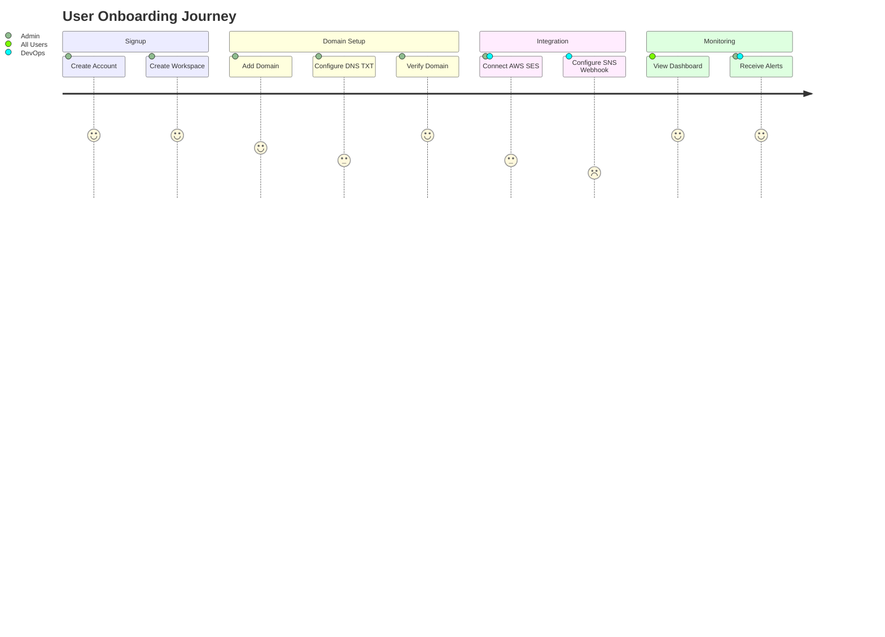
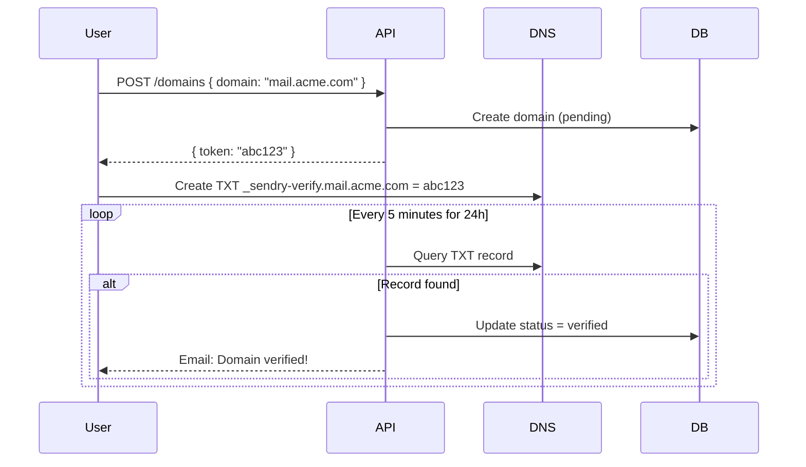
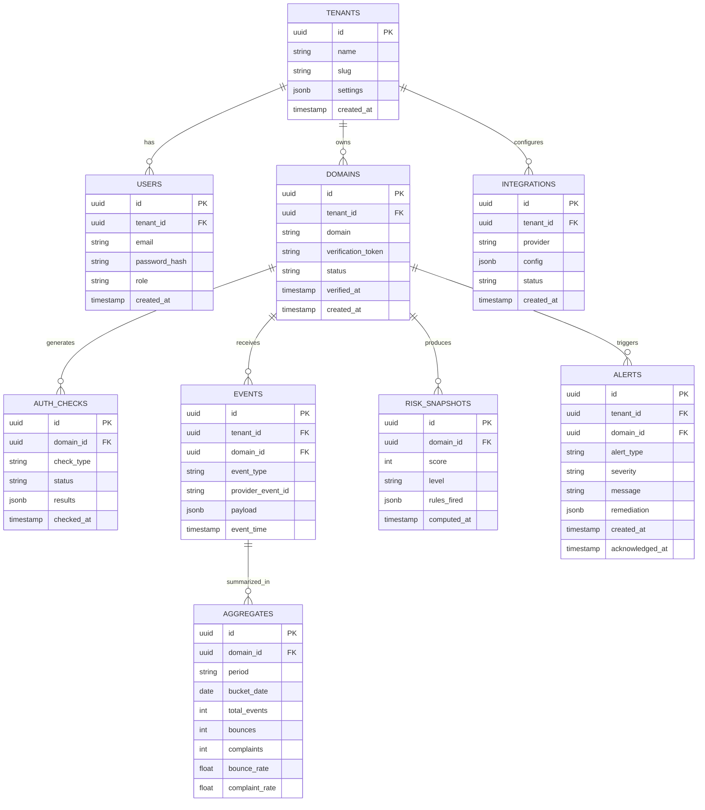

# PRD — Sendry: Email Deliverability Control Plane

> **Version:** 1.0  
> **Last Updated:** February 7, 2026  
> **Status:** Draft

---

## 1. Executive Summary

### Product Name
**Sendry**

### One-line Description
Sendry is a multi-tenant SaaS platform that monitors and protects a company's email deliverability by validating domain authentication (SPF/DKIM/DMARC), ingesting ESP bounce/complaint events, computing reputation risk, and sending early-warning alerts.

### Product Type
B2B SaaS (Control plane + Monitoring + Enforcement)

### Target Market
SaaS companies (Series A+), eCommerce, Fintech with high email volume (10K+ emails/month)

---

## 2. Problem Statement

### The Core Problem
Most SaaS companies rely on email for critical operations:
- Password resets & login OTPs
- Onboarding flows
- Invoices & receipts
- Notifications
- Marketing campaigns

### Impact of Deliverability Failures

| Impact Area | Consequence |
|-------------|-------------|
| Revenue | Failed transactional emails → lost sales |
| User Churn | Blocked accounts → user frustration |
| Support Load | "I didn't receive email" tickets |
| Brand Damage | Spam folder = untrusted sender |

### Why Issues Are Hard to Debug

```
┌─────────────────────────────────────────────────────────┐
│  DNS changes silently break SPF/DMARC                   │
│  ↓                                                      │
│  Authentication failures don't notify you               │
│  ↓                                                      │
│  Bounce/complaint trends aren't tracked centrally       │
│  ↓                                                      │
│  ESP throttles/blocks with minimal warning              │
│  ↓                                                      │
│  You find out when users complain                       │
└─────────────────────────────────────────────────────────┘
```

---

## 3. Goals and Non-Goals

### Goals (MVP)
| Priority | Goal |
|----------|------|
| P0 | Detect broken authentication (SPF/DKIM/DMARC) within 1 hour |
| P0 | Monitor bounce/complaint trends and detect spikes |
| P0 | Generate explainable risk score per domain |
| P1 | Provide actionable alerts with remediation steps |
| P1 | Support AWS SES event ingestion |

### Non-Goals (MVP)
- ❌ Send emails (not an ESP replacement)
- ❌ Replace AWS SES/SendGrid
- ❌ Full inbox placement prediction
- ❌ Machine learning scoring (rules-based v1)
- ❌ Support 5+ providers

---

## 4. Target Users

### Personas

| Persona | Role | Primary Need |
|---------|------|--------------|
| **DevOps Dan** | SRE/Platform Engineer | Proactive monitoring, incident alerts |
| **Backend Betty** | Backend Developer | Quick domain setup, API integration |
| **Marketing Mike** | Growth/Marketing Ops | Read-only dashboards, trend visibility |
| **Founder Fiona** | CTO/Founder | High-level health overview |

### User Journey Map



---

## 5. Core Use Cases

### UC1 — Domain Onboarding
**Actor:** Admin  
**Trigger:** User adds a new sending domain  
**Flow:**
1. User enters domain (e.g., `mail.acme.com`)
2. Sendry generates unique verification token
3. User creates TXT record: `_sendry-verify.mail.acme.com`
4. Sendry polls DNS until verified (max 24h retry)
5. Domain becomes active for monitoring

**Success Criteria:** Domain verified in <5 minutes after DNS propagation

---

### UC2 — Authentication Monitoring
**Actor:** System (Scheduled)  
**Trigger:** Hourly cron job  
**Checks Performed:**

| Check | Severity if Failed |
|-------|-------------------|
| SPF record missing | HIGH |
| SPF syntax invalid | HIGH |
| SPF lookups > 10 | MEDIUM |
| SPF policy `+all` | HIGH |
| DMARC missing | HIGH |
| DMARC `p=none` | MEDIUM |
| DKIM missing | MEDIUM (v2) |

---

### UC3 — Event Ingestion (AWS SES)
**Flow:**
```
┌─────────┐    ┌─────────┐    ┌──────────────┐    ┌─────────────┐
│ AWS SES │───►│   SNS   │───►│ Sendry       │───►│ Event Queue │
│         │    │         │    │ Webhook API  │    │ (Redis)     │
└─────────┘    └─────────┘    └──────────────┘    └──────┬──────┘
                                                         │
                                                         ▼
                                                  ┌──────────────┐
                                                  │ Event Worker │
                                                  │ (Normalize & │
                                                  │  Store)      │
                                                  └──────────────┘
```

---

### UC4 — Risk Scoring
**Trigger:** Every 5 minutes per domain  
**Output:**
```json
{
  "domain_id": "uuid",
  "score": 72,
  "level": "MEDIUM",
  "reasons": [
    { "rule": "DMARC_POLICY_WEAK", "impact": -10 },
    { "rule": "BOUNCE_RATE_ELEVATED", "impact": -18 }
  ],
  "computed_at": "2026-02-07T10:00:00Z"
}
```

---

### UC5 — Alerting
**Alert Types:**

| Type | Trigger | Dedupe Window |
|------|---------|---------------|
| AUTH_BROKEN | SPF/DMARC validation fails | 1 hour |
| BOUNCE_SPIKE | bounce_rate_1h > 5% | 15 minutes |
| COMPLAINT_SPIKE | complaint_rate_1h > 0.1% | 15 minutes |
| RISK_ESCALATION | Level changes to HIGH | 1 hour |

---

### UC6 — Safe-Sending Enforcement (v2)
**Endpoint:** `POST /can-send`  
**Response:**
```json
{
  "decision": "THROTTLE",
  "max_rate": 100,
  "reason": "Elevated bounce rate detected",
  "ttl_seconds": 300
}
```

---

## 6. Product Scope

### MVP Scope ✅

| Module | Features |
|--------|----------|
| **Auth & Tenant** | Signup, Login, Workspace, Basic roles (Admin/Member/Viewer) |
| **Domains** | Add, Verify (TXT), List, Remove |
| **Auth Health** | SPF validation, DMARC validation, Scheduled checks |
| **Integration** | AWS SES webhook ingestion |
| **Metrics** | Bounce rate, Complaint rate (1h/24h/7d), Trend charts |
| **Risk Engine** | Rules-based scoring, Snapshot history, Explainable rules |
| **Alerts** | Email delivery, Dedupe, Alert history |
| **Dashboard** | Login, Workspace, Domains, Domain detail, Alerts, Settings |

### v2 Scope 🔮

| Module | Features |
|--------|----------|
| **Auth** | DKIM validation |
| **Integrations** | SendGrid, Mailgun, Postmark |
| **Alerts** | Slack, Webhook destinations |
| **Enforcement** | `/can-send` API |
| **Analytics** | Baseline anomaly detection |
| **Incidents** | Deliverability incident timeline |

---

## 7. Functional Requirements

### 7.1 Authentication Monitoring

#### SPF Validation Rules
```yaml
rules:
  - id: SPF_MISSING
    check: No SPF record found
    severity: HIGH
    
  - id: SPF_SYNTAX_INVALID
    check: SPF record fails parsing
    severity: HIGH
    
  - id: SPF_TOO_MANY_LOOKUPS
    check: DNS lookups > 10
    severity: MEDIUM
    
  - id: SPF_DANGEROUS_ALL
    check: Policy ends with +all
    severity: HIGH
```

#### DMARC Validation Rules
```yaml
rules:
  - id: DMARC_MISSING
    check: No DMARC record at _dmarc.domain
    severity: HIGH
    
  - id: DMARC_POLICY_NONE
    check: p=none without rua
    severity: MEDIUM
    
  - id: DMARC_NO_REPORTING
    check: Missing rua and ruf
    severity: LOW
```

#### Scheduling
- **Default:** Check every 1 hour
- **Manual:** "Run check now" button
- **On-demand:** API trigger

---

### 7.2 Domain Verification

#### Verification Flow


#### Requirements
- Retry for up to 24 hours
- Token unique per tenant
- Domain locked until verified

---

### 7.3 Provider Integration (AWS SES)

#### Webhook Endpoint
```
POST /webhooks/ses
Content-Type: application/json
X-Amz-Sns-Message-Type: Notification
```

#### Security Requirements
- ✅ Validate SNS message signature
- ✅ Verify TopicArn belongs to customer
- ✅ Rate limit: 1000 req/min per tenant
- ✅ Idempotency via `provider_event_id`

#### Retry & DLQ
```yaml
retry:
  max_attempts: 3
  backoff: exponential
  initial_delay: 1s
  
dlq:
  enabled: true
  retention: 7 days
  alert_threshold: 100 messages
```

---

### 7.4 Event Schema

#### Raw Event Storage
```sql
CREATE TABLE raw_events (
    id              UUID PRIMARY KEY,
    tenant_id       UUID NOT NULL,
    domain_id       UUID NOT NULL,
    provider        VARCHAR(50),
    provider_event_id VARCHAR(255) UNIQUE,
    payload         JSONB,
    received_at     TIMESTAMPTZ DEFAULT NOW()
);
```

#### Normalized Event Schema
```sql
CREATE TABLE events (
    id              UUID PRIMARY KEY,
    tenant_id       UUID NOT NULL,
    domain_id       UUID NOT NULL,
    event_type      VARCHAR(20), -- bounce|complaint|delivery|reject|delay
    timestamp       TIMESTAMPTZ,
    message_id      VARCHAR(255),
    recipient_hash  VARCHAR(64), -- SHA256 for privacy
    bounce_type     VARCHAR(20), -- hard|soft|undetermined
    reason_code     VARCHAR(100),
    created_at      TIMESTAMPTZ DEFAULT NOW()
);

CREATE INDEX idx_events_domain_time ON events(domain_id, timestamp);
CREATE INDEX idx_events_type ON events(event_type);
```

---

### 7.5 Aggregation & Metrics

#### Required Metrics per Domain
| Metric | Window | Calculation |
|--------|--------|-------------|
| `bounce_rate_1h` | 1 hour | bounces / deliveries |
| `bounce_rate_24h` | 24 hours | bounces / deliveries |
| `complaint_rate_1h` | 1 hour | complaints / deliveries |
| `complaint_rate_24h` | 24 hours | complaints / deliveries |
| `total_events_24h` | 24 hours | count(*) |
| `bounce_spike_ratio` | 1h vs 24h avg | current_1h / avg_1h_over_24h |

#### Aggregation Schedule
```
┌─────────────────────────────────────────┐
│ Hourly Aggregates: Every hour at :00    │
│ Daily Aggregates: Every day at 00:05    │
│ Snapshot: Every 5 minutes               │
└─────────────────────────────────────────┘
```

---

### 7.6 Risk Scoring Engine

#### Score Calculation
```python
base_score = 100

for rule in fired_rules:
    base_score -= rule.penalty

level = (
    "HIGH" if score < 50 else
    "MEDIUM" if score < 75 else
    "LOW"
)
```

#### Rule Definitions
| Rule ID | Condition | Penalty | Level |
|---------|-----------|---------|-------|
| DMARC_MISSING | No DMARC record | 30 | HIGH |
| SPF_INVALID | SPF parsing fails | 25 | HIGH |
| SPF_LOOKUPS_EXCEEDED | lookups > 10 | 15 | MEDIUM |
| BOUNCE_RATE_HIGH | bounce_rate_24h > 5% | 25 | HIGH |
| COMPLAINT_RATE_HIGH | complaint_rate_24h > 0.1% | 30 | HIGH |
| BOUNCE_SPIKE | spike_ratio > 2x | 15 | MEDIUM |
| DMARC_POLICY_WEAK | p=none | 10 | MEDIUM |

#### Storage
```sql
CREATE TABLE risk_snapshots (
    id          UUID PRIMARY KEY,
    domain_id   UUID NOT NULL,
    score       INT,
    level       VARCHAR(10),
    rules_fired JSONB,
    computed_at TIMESTAMPTZ DEFAULT NOW()
);
```

---

### 7.7 Alerts

#### Alert Structure
```json
{
  "id": "uuid",
  "tenant_id": "uuid",
  "domain_id": "uuid",
  "type": "BOUNCE_SPIKE",
  "severity": "HIGH",
  "message": "Bounce rate spiked to 8.5% (threshold: 5%)",
  "remediation": [
    "Check recent email campaign quality",
    "Review recipient list for invalid addresses",
    "Verify ESP sending limits"
  ],
  "created_at": "2026-02-07T10:00:00Z",
  "acknowledged_at": null
}
```

#### Dedupe Rules
- Same alert type + domain: min 1 hour gap
- Spike alerts: require persistence for 15 min
- Escalation: wait for 2 consecutive checks

---

## 8. System Architecture

### High-Level Architecture

```
┌──────────────────────────────────────────────────────────────────┐
│                         SENDRY PLATFORM                          │
├──────────────┬───────────────────────────────────┬───────────────┤
│              │                                   │               │
│   Frontend   │           API Gateway             │   Workers     │
│   (Next.js)  │           (Express)               │   (Bull/BullMQ)│
│              │                                   │               │
│  ┌────────┐  │  ┌────────────────────────────┐  │  ┌──────────┐ │
│  │Dashboard│  │  │  /auth  /domains  /alerts │  │  │ DNS Check│ │
│  │Domain   │  │  │  /webhooks  /integrations │  │  │ Worker   │ │
│  │Alerts   │  │  │  /metrics  /risk          │  │  └──────────┘ │
│  │Settings │  │  └────────────────────────────┘  │  ┌──────────┐ │
│  └────────┘  │               │                   │  │ Event    │ │
│              │               │                   │  │ Processor│ │
│              │               ▼                   │  └──────────┘ │
│              │  ┌────────────────────────────┐  │  ┌──────────┐ │
│              │  │     PostgreSQL + Redis     │  │  │ Risk     │ │
│              │  │     (Data + Queues)        │  │  │ Engine   │ │
│              │  └────────────────────────────┘  │  └──────────┘ │
│              │                                   │  ┌──────────┐ │
│              │                                   │  │ Alert    │ │
│              │                                   │  │ Sender   │ │
│              │                                   │  └──────────┘ │
└──────────────┴───────────────────────────────────┴───────────────┘
                               │
                               ▼
                    ┌────────────────────┐
                    │  External Services │
                    │  - AWS SES/SNS     │
                    │  - DNS Servers     │
                    │  - SMTP (alerts)   │
                    └────────────────────┘
```

### Database Schema (ERD)



---

## 9. API Specification

### Authentication

#### POST /auth/signup
```json
// Request
{
  "email": "admin@acme.com",
  "password": "securePass123!",
  "workspace_name": "Acme Corp"
}

// Response 201
{
  "user": { "id": "uuid", "email": "admin@acme.com", "role": "admin" },
  "tenant": { "id": "uuid", "name": "Acme Corp", "slug": "acme-corp" },
  "token": "jwt..."
}
```

#### POST /auth/login
```json
// Request
{ "email": "admin@acme.com", "password": "securePass123!" }

// Response 200
{ "token": "jwt...", "user": { ... } }
```

---

### Domains

#### POST /domains
```json
// Request
{ "domain": "mail.acme.com" }

// Response 201
{
  "id": "uuid",
  "domain": "mail.acme.com",
  "status": "pending",
  "verification_token": "sendry-verify-abc123",
  "verification_record": "_sendry-verify.mail.acme.com TXT sendry-verify-abc123"
}
```

#### GET /domains/:id
```json
// Response 200
{
  "id": "uuid",
  "domain": "mail.acme.com",
  "status": "verified",
  "verified_at": "2026-02-07T10:00:00Z",
  "auth_status": {
    "spf": { "valid": true, "last_check": "..." },
    "dmarc": { "valid": false, "error": "Record missing", "last_check": "..." }
  },
  "risk": {
    "score": 65,
    "level": "MEDIUM"
  }
}
```

#### POST /domains/:id/check-auth-now
```json
// Response 202
{ "message": "Auth check queued", "job_id": "uuid" }
```

---

### Metrics & Risk

#### GET /domains/:id/metrics
```json
// Query: ?period=24h
// Response 200
{
  "bounce_rate": 2.5,
  "complaint_rate": 0.05,
  "total_events": 15420,
  "timeline": [
    { "hour": "2026-02-07T09:00:00Z", "bounces": 12, "complaints": 1, "deliveries": 520 }
  ]
}
```

#### GET /domains/:id/risk
```json
// Response 200
{
  "current": {
    "score": 72,
    "level": "MEDIUM",
    "rules_fired": [
      { "id": "DMARC_POLICY_WEAK", "message": "DMARC policy is p=none", "penalty": 10 }
    ],
    "computed_at": "2026-02-07T10:00:00Z"
  },
  "history": [ ... ]
}
```

---

### Webhooks

#### POST /webhooks/ses
```json
// AWS SNS Notification Format
// Headers: x-amz-sns-message-type, x-amz-sns-topic-arn
// Body: SNS notification wrapper containing SES event
```

**Response Codes:**
- `200` — Event processed
- `400` — Invalid payload
- `401` — Signature verification failed
- `409` — Duplicate event (idempotent)
- `429` — Rate limited
- `500` — Internal error (will retry)

---

### Alerts

#### GET /domains/:id/alerts
```json
// Query: ?status=unacknowledged&limit=50
// Response 200
{
  "alerts": [
    {
      "id": "uuid",
      "type": "BOUNCE_SPIKE",
      "severity": "HIGH",
      "message": "Bounce rate exceeded 5%",
      "remediation": ["Check campaign quality", "Review recipient list"],
      "created_at": "2026-02-07T10:00:00Z"
    }
  ],
  "pagination": { "total": 12, "page": 1 }
}
```

---

## 10. Non-Functional Requirements

### Performance

| Metric | Target |
|--------|--------|
| Dashboard load time | < 2 seconds |
| API response time (p95) | < 500ms |
| Webhook ingestion | Handle 1000+ events/min |
| Risk engine execution | < 2 seconds per domain |

### Reliability

| Component | Target |
|-----------|--------|
| Webhook ingestion success | > 99.9% |
| System uptime | > 99.5% |
| Data durability | 99.99% |
| Alert delivery | Within 5 min of trigger |

### Security

| Requirement | Implementation |
|-------------|----------------|
| Authentication | JWT with RS256 |
| Tenant isolation | tenant_id on every query |
| Webhook auth | SNS signature verification |
| Rate limiting | 100 req/min per user, 1000/min webhooks |
| Secrets | Environment variables / Vault |
| Data privacy | Hash recipient emails (SHA256) |

### Observability

```yaml
logging:
  format: structured JSON
  fields: [request_id, tenant_id, duration_ms, status]
  
metrics:
  - ingestion_rate_per_minute
  - failed_jobs_count
  - webhook_latency_p95
  - risk_engine_duration_p95
  - alert_delivery_latency
  
tracing:
  enabled: true
  sample_rate: 10%
  provider: OpenTelemetry
```

---

## 11. Tech Stack

### Frontend
| Layer | Technology |
|-------|------------|
| Framework | Next.js 14 (App Router) |
| Language | TypeScript |
| Styling | Tailwind CSS |
| State | React Query + Zustand |
| Charts | Recharts / Chart.js |

### Backend
| Layer | Technology |
|-------|------------|
| Runtime | Node.js 20 (or Bun) |
| API Framework | Express.js |
| Queue | BullMQ (Redis) |
| ORM | Prisma |
| Validation | Zod |

### Data
| Layer | Technology |
|-------|------------|
| Primary DB | PostgreSQL 15 |
| Cache/Queue | Redis 7 |
| Migrations | Prisma Migrate |

### Infrastructure
| Layer | Technology |
|-------|------------|
| Container | Docker |
| Orchestration | Docker Compose (dev), Kubernetes (prod) |
| Cloud | AWS (primary) / Vercel (frontend) |
| DNS | AWS Route53 / Cloudflare |
| Monitoring | Prometheus + Grafana |
| Logging | Loki / CloudWatch |

---

## 12. User Stories (MVP)

### Epic: Onboarding
- [ ] As an Admin, I can sign up and create a workspace
- [ ] As an Admin, I can invite team members
- [ ] As an Admin, I can add a domain and verify ownership
- [ ] As a User, I can view verification instructions

### Epic: Monitoring
- [ ] As a User, I can see SPF/DMARC health status
- [ ] As a User, I can see last check timestamp and results
- [ ] As a User, I can manually trigger an auth check
- [ ] As a User, I can view bounce/complaint trends

### Epic: Risk
- [ ] As a User, I can see a risk score (0-100)
- [ ] As a User, I can see which rules affected the score
- [ ] As a User, I can view risk history

### Epic: Alerts
- [ ] As a User, I receive email alerts for critical issues
- [ ] As a User, I can view alert history
- [ ] As a User, I can acknowledge alerts
- [ ] As an Admin, I can configure alert thresholds

### Epic: Integration
- [ ] As an Admin, I can connect AWS SES
- [ ] As a User, I can view integration status

---

## 13. Success Metrics

### Product Metrics

| Metric | Target | Measurement |
|--------|--------|-------------|
| Domain verification rate | > 80% | Verified / Total added |
| Mean time to detect auth break | < 1 hour | Time from break to alert |
| Mean time to detect bounce spike | < 15 min | Time from spike to alert |
| Alert noise ratio | < 2/domain/week | Alerts / domain / week |
| User activation | > 60% | Users with verified domain in 7 days |

### Engineering Metrics

| Metric | Target | Measurement |
|--------|--------|-------------|
| Webhook ingestion success rate | > 99.9% | Success / Total received |
| Duplicate event rate | < 0.1% | Duplicates / Total events |
| Risk engine P95 latency | < 2s | P95 execution time |
| API availability | > 99.5% | Uptime percentage |

---

## 14. MVP Development Timeline

### Phase 1: Foundation (Week 1-2)
```
[ ] Project setup (monorepo, linting, CI)
[ ] Database schema + migrations
[ ] Auth system (signup, login, JWT)
[ ] Tenant + User management
```

### Phase 2: Core Domain Logic (Week 3-4)
```
[ ] Domain CRUD
[ ] DNS verification flow
[ ] SPF/DMARC validation engine
[ ] Scheduled auth checks
```

### Phase 3: Event Ingestion (Week 5-6)
```
[ ] Webhook endpoint for SES
[ ] Event queue + worker
[ ] Raw + normalized event storage
[ ] Idempotency handling
```

### Phase 4: Analytics & Risk (Week 7-8)
```
[ ] Aggregation jobs
[ ] Metrics API
[ ] Risk scoring engine
[ ] Risk snapshot storage
```

### Phase 5: Alerts & UI (Week 9-10)
```
[ ] Alert generation logic
[ ] Email delivery
[ ] Dashboard pages
[ ] Domain detail views
```

### Phase 6: Polish & Launch (Week 11-12)
```
[ ] Error handling
[ ] Observability setup
[ ] Load testing
[ ] Documentation
[ ] Beta launch
```

---

## 15. Risks & Mitigations

| Risk | Impact | Probability | Mitigation |
|------|--------|-------------|------------|
| DNS validation complexity | Medium | High | Clear UI, retry logic, show raw DNS results |
| Webhook reliability | High | Medium | Queue buffer, DLQ, idempotency |
| Alert fatigue | Medium | High | Dedupe, persistence requirement, thresholds |
| Tenant data leakage | Critical | Low | RLS policies, query audit, penetration testing |
| Provider API changes | Medium | Low | Adapter pattern, version detection |

---

## 16. Out of Scope (Explicit)

The following are **explicitly not in MVP**:

| Feature | Reason |
|---------|--------|
| Sending emails | Not an ESP |
| ML-based scoring | Complexity, data requirements |
| Inbox placement prediction | Requires sending infrastructure |
| Multi-provider support (5+) | Focus on SES for v1 |
| Complex team permissions | Basic roles sufficient |
| Advanced incident workflows | v2 feature |
| DKIM validation | Complex key management |

---

## 17. Appendix

### A. Glossary

| Term | Definition |
|------|------------|
| **SPF** | Sender Policy Framework — DNS record listing authorized mail servers |
| **DKIM** | DomainKeys Identified Mail — cryptographic email signature |
| **DMARC** | Domain-based Message Authentication — policy for handling auth failures |
| **ESP** | Email Service Provider (SES, SendGrid, Postmark) |
| **Bounce** | Email rejected by recipient server |
| **Complaint** | Recipient marked email as spam |

### B. References

- [RFC 7208 - SPF](https://www.rfc-editor.org/rfc/rfc7208)
- [RFC 7489 - DMARC](https://www.rfc-editor.org/rfc/rfc7489)
- [AWS SES Notifications](https://docs.aws.amazon.com/ses/latest/dg/notification-contents.html)
- [Google Postmaster Tools](https://support.google.com/mail/answer/9981691)

### C. Competitive Landscape

| Competitor | Strengths | Weaknesses |
|------------|-----------|------------|
| Postmark Activity | Great UX | Limited to Postmark users |
| SendGrid Insights | Deep analytics | Expensive, complex |
| Valimail | Enterprise grade | Expensive, slow onboarding |
| dmarcian | DMARC focus | No event ingestion |

**Sendry Differentiation:**
- ✅ Single pane of glass for auth + reputation
- ✅ Developer-first API
- ✅ Affordable for Series A+ SaaS
- ✅ Explainable risk scoring

---

> **Final Note:** This PRD represents a **production-grade** email deliverability platform. Cutting corners on webhook reliability, idempotency, or explainable scoring will reduce Sendry to a forgettable monitoring tool. Execute with discipline.
